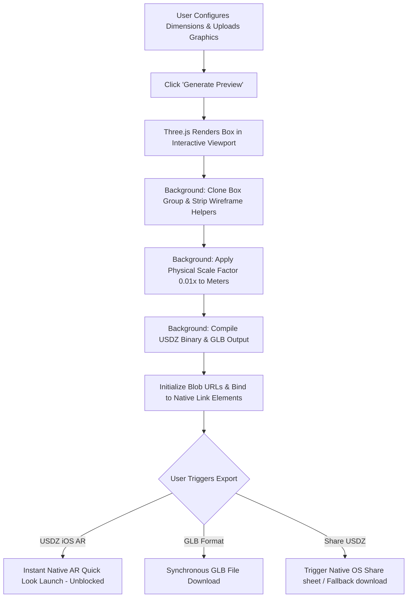

<div align="center">

# 📦 Box Studio — Admin Panel

**An elite, high-fidelity 3D box visualizer, packaging design suite, and native AR export pipeline built for the web.**

[](https://developer.mozilla.org/en-US/docs/Web/HTML)
[](https://developer.mozilla.org/en-US/docs/Web/CSS)
[](https://developer.mozilla.org/en-US/docs/Web/JavaScript)
[](https://threejs.org/)
[](https://developer.mozilla.org/en-US/docs/Web/API/WebGL_API)
[](#)

*Design cardboard packaging, wrap custom artwork textures, verify live in 3D, and launch natively on iPhone/Android AR at perfect real-world dimensions.*

---

[Core Features](#-core-features) • [System Flow](#-architecture--data-flow) • [Quick Start](#-quick-start) • [Export Pipeline](#-the-ar-export-pipeline) • [Aesthetics](#-modern-glassmorphism-aesthetics)

</div>

---

## 💎 Core Features

<table width="100%">
  <tr>
    <td width="50%" valign="top">
      <h3>🎨 Custom Texture Mapping</h3>
      <p>Upload and wrap individual high-resolution artwork maps (<code>.png</code>, <code>.jpg</code>) directly onto separate box faces including front, back, top, bottom, and side flaps.</p>
    </td>
    <td width="50%" valign="top">
      <h3>⚡ Instant AR Launch</h3>
      <p>Pre-rendered background assets compile automatically, allowing iOS Safari users to launch AR Quick Look instantly and synchronously without security block warnings.</p>
    </td>
  </tr>
  <tr>
    <td width="50%" valign="top">
      <h3>📐 Smart Dimensioning</h3>
      <p>Input dimensions in <b>millimeters (mm)</b>, <b>centimeters (cm)</b>, or <b>inches (in)</b>. Our system handles auto-scaling, dynamic hints, and visual canvas refreshes.</p>
    </td>
    <td width="50%" valign="top">
      <h3>🌐 Universal 3D Formats</h3>
      <p>Download clean <b>GLB</b> files for web integrations (Three.js, Babylon) and Android AR, or zipped <b>USDZ</b> binaries for Apple environments.</p>
    </td>
  </tr>
</table>

---

## 🔄 Architecture & Data Flow

Below is the layout of the application's preview and compile pipeline, rendered natively using Mermaid:



---

## 🚀 Quick Start

Modern browsers enforce CORS restrictions on local file modules (`type="module"`). To run the project locally without errors, launch it via an HTTP server:

### 1. Host the project
Choose **one** of the following terminal commands inside the project directory:

```bash
# Option A: Node.js (Recommended)
npx http-server -p 8080

# Option B: Python (3.x)
python -m http.server 8080

# Option C: Python (2.x)
python -m SimpleHTTPServer 8080
```

### 2. View in Browser
Open your browser and navigate to:
```url
http://localhost:8080
```

---

## ⚙️ The AR Export Pipeline

### 📏 Perfect Real-World Dimensions
To make sure models appear exactly at their physical dimensions inside Google Scene Viewer and Apple AR Quick Look, the exporter scales all dimensions from centimeters down to meters (scaled by `0.01`). This ensures a 300mm box renders as **0.3m** in physical AR space instead of a massive **30m** structure.

### 🛡️ Bypassing Safari Popup Blocking
iOS Safari blocks any programmatic `.click()` on `rel="ar"` elements that happen after asynchronous promises (like waiting for `exporter.parse()`). 
To solve this, Box Studio pre-generates the USDZ model in the background as soon as the preview is generated, caching the File object and assigning it to the links. When the user taps the button, Safari launches AR Quick Look instantly with **zero async latency**.

> [!IMPORTANT]
> **Web Share Contexts**: Direct file sharing using the **Share USDZ** button is a security-sensitive browser API (`navigator.share`). It requires a secure context (**HTTPS**) to work on mobile browsers. Over insecure local testing (HTTP), the button will gracefully download the file instead.

---

## 🎨 Modern Glassmorphism Aesthetics

Box Studio's dashboard uses a glassmorphism style sheet layered directly over the Three.js viewport:

```
+--------------------------------------------------------+
|  [📐 Dimension Controls]                               |
|  - Length, Width, Height Input   [   3D Interactive   ] |
|  - Multi-Unit Toggle pills       [       Viewer       ] |
|                                  [                    ] |
|  [🎨 Texture Upload Grid]        [   (Three.js scene) ] |
|  - Upload Front, Back, Sides     [                    ] |
|                                  [                    ] |
|  [⬇️ Export Drawer]              [   [📦 View in AR]  ] |
|  - GLB File  |  USDZ File        [ (Mobile AR Overlay)] |
+--------------------------------------------------------+
```

*   **Panel Transparency:** Styled with translucent backgrounds (`rgba(18, 19, 24, 0.6)`) and `-webkit-backdrop-filter: blur(28px)`.
*   **Aesthetic Typography:** Using Google Fonts' `Outfit` for headings and `Inter` for parameters and numeric lists.
